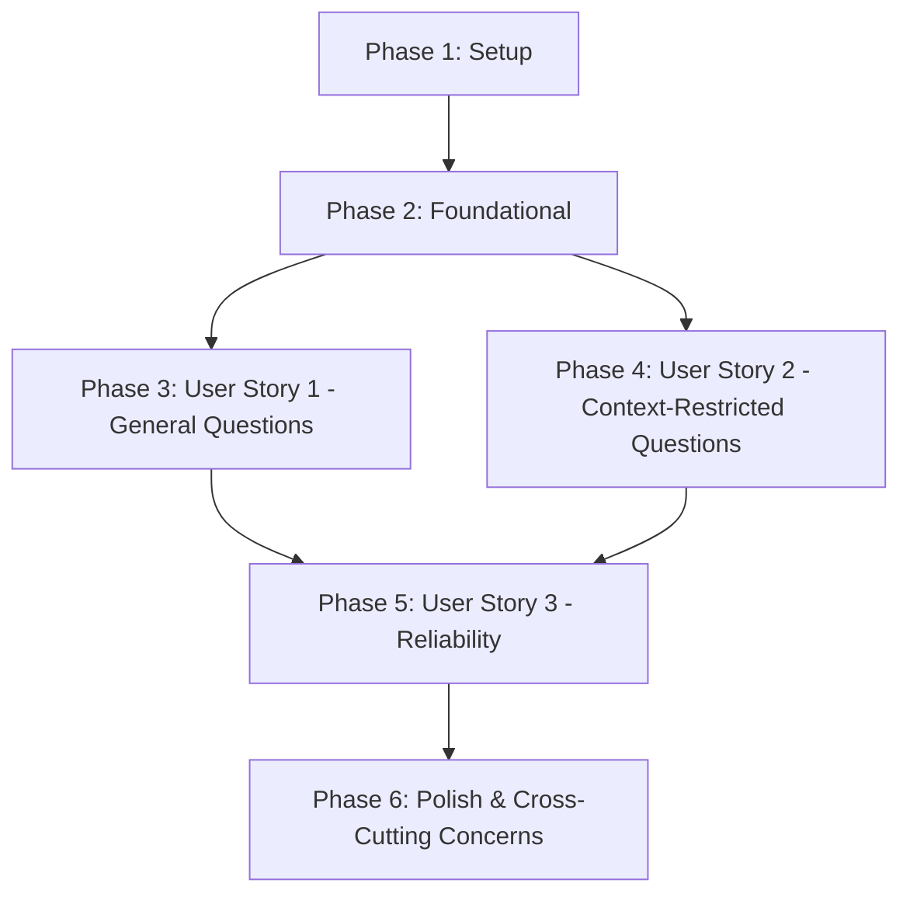

# Tasks: Integrate RAG Chatbot

**Branch**: `007-integrate-rag-chatbot` | **Date**: 2025-12-17 | **Spec**: specs/007-integrate-rag-chatbot/spec.md
**Plan**: specs/007-integrate-rag-chatbot/plan.md

## Summary

This document outlines the detailed, dependency-ordered tasks required to integrate the RAG chatbot backend with the Docusaurus-based book frontend. Tasks are organized by user story to facilitate independent development and testing, ensuring a clear path to delivering incremental value.

## Dependency Graph (User Story Completion Order)

The user stories have been prioritized as follows:
-   **P1**: User Story 1 (Ask General Questions about Book Content)
-   **P1**: User Story 2 (Ask Context-Restricted Questions)
-   **P2**: User Story 3 (Local Development Reliability)

User Story 1 and User Story 2 can be developed largely in parallel, with some shared foundational elements. User Story 3 builds upon the successful implementation of User Stories 1 and 2, focusing on testing and hardening the integration.

## Parallel Execution Opportunities

-   **Frontend UI development for general questions (US1)** can be done in parallel with **Backend CORS configuration**.
-   **Frontend UI development for context-restricted questions (US2)** can be started once basic text selection mechanisms are identified.
-   **API communication logic (US1 & US2)** can be developed in parallel, assuming the backend `/chat` endpoint is available.

## Implementation Strategy

The implementation will follow an incremental delivery approach, focusing on delivering a minimum viable product (MVP) for User Story 1 first, then enhancing it with User Story 2, and finally solidifying with User Story 3.

## Phase 1: Setup

Goal: Prepare the development environment and project structure.

-   [x] T001 Clone the feature branch `007-integrate-rag-chatbot` locally.
-   [x] T002 Ensure Python 3.11+ is installed for backend development.
-   [x] T003 Ensure Node.js 20+ is installed for frontend development.

## Phase 2: Foundational

Goal: Establish core backend and frontend infrastructure necessary for chatbot integration.

-   [x] T004 Enable CORS middleware in `backend/src/api/main.py` to allow requests from the Docusaurus frontend (`http://localhost:3000`).
-   [x] T005 Implement a placeholder `/chat` POST endpoint in `backend/src/api/main.py` that accepts `user_query` and `selected_text` and returns a dummy response `{"answer": "Dummy response."}`.

## Phase 3: User Story 1 - Ask General Questions about Book Content (Priority: P1)

Goal: Allow readers to ask general questions about book content and receive responses.

-   [x] T006 [P] [US1] Create a new React component for the chatbot UI (e.g., `frontend/src/components/Chatbot/Chatbot.js`).
-   [x] T007 [US1] Integrate the `Chatbot` component into a suitable location in the Docusaurus frontend (e.g., a sidebar or a floating action button).
-   [x] T008 [P] [US1] Implement an input field within the `Chatbot` component for users to type their questions.
-   [x] T009 [P] [US1] Implement a submit action in the `Chatbot` component to trigger a backend request when a question is submitted.
-   [x] T010 [US1] Implement API communication logic in `frontend/src/utils/chatbotApi.js` to send `user_query` to the FastAPI `/chat` endpoint.
-   [x] T011 [US1] Implement rendering logic in the `Chatbot` component to display the `answer` from the API response.
-   [x] T012 [US1] Apply Docusaurus root page styling to the `Chatbot` component for consistent appearance.
-   [x] T013 [US1] Ensure `Chatbot` component handles and displays generic, user-friendly error messages as per `FR-007` when API communication fails.

## Phase 4: User Story 2 - Ask Context-Restricted Questions (Priority: P1)

Goal: Allow readers to select text and ask questions based on that context.

-   [x] T014 [P] [US2] Implement JavaScript logic in `frontend/src/utils/textSelection.js` to capture user-selected text from the Docusaurus page.
-   [x] T015 [US2] Modify the `Chatbot` component and `chatbotApi.js` to include the captured `selected_text` in the API request payload to `/chat`.
-   [x] T016 [US2] Verify through local testing that `selected_text` is correctly sent to the backend.

## Phase 5: User Story 3 - Local Development Reliability (Priority: P2)

Goal: Ensure the integrated chatbot works reliably in a local development environment.

-   [x] T017 [US3] Conduct comprehensive end-to-end testing of the chatbot integration in a local development environment for 1 hour to ensure no critical errors occur (referencing `SC-005`).
-   [x] T018 [US3] Verify that the frontend remains responsive and interactive, gracefully handling scenarios where the backend is temporarily unavailable (referencing `SC-005`).
-   [x] T019 [US3] Verify correct display of messages for unrelated questions (`FR-008`) and when no relevant information is found (`FR-009`).

## Phase 6: Polish & Cross-Cutting Concerns

Goal: Finalize the feature and ensure overall quality.

-   [x] T020 Review and refine `Chatbot` component styling and responsiveness.
-   [x] T021 Clean up any temporary code or configurations introduced during development.
-   [x] T022 Update the `quickstart.md` with any final setup instructions or changes.
-   [x] T023 Mark the feature `007-integrate-rag-chatbot` as complete.

## Suggested MVP Scope

The MVP for this feature would encompass **Phase 1, Phase 2, and Phase 3 (User Story 1)**. This allows users to ask general questions about the book content, providing immediate contextual AI assistance.

## Test Criteria (per User Story)

### User Story 1 - Ask General Questions about Book Content
-   **Independent Test**: Open the chatbot UI, type a general question related to the book, and receive a relevant answer.
-   **Acceptance Criteria Met**: FR-001, FR-002, FR-004, FR-005, FR-007, SC-001, SC-002, SC-004.

### User Story 2 - Ask Context-Restricted Questions
-   **Independent Test**: Select specific text within the book, activate the chatbot, ask a question based on the selection, and verify the answer is restricted to the selected context.
-   **Acceptance Criteria Met**: FR-003, SC-003.

### User Story 3 - Local Development Reliability
-   **Independent Test**: Run both frontend and backend locally for an extended period, interact with the chatbot, and observe consistent, error-free operation, including graceful handling of backend unavailability.
-   **Acceptance Criteria Met**: FR-006, SC-005.
